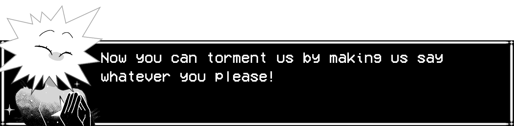
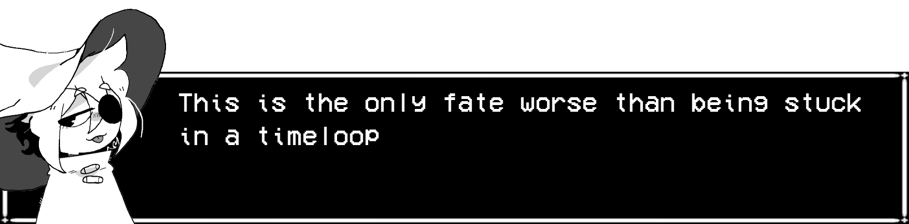
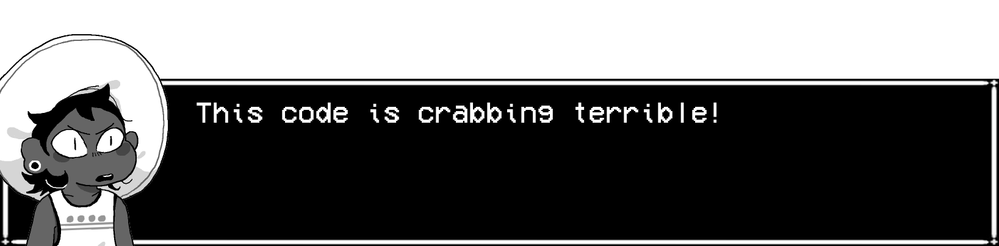

# ISAT-Textbox-Generator

**Inspired by the UT/DR textbox creator, here's a hastily made tool to do the same for In Stars and Time!**

This repo doesn't include any game assests, so you'll need to own the game to use the tool.

# Installation And Use

To run this, install python and run from source. Alternatively take the easy route and download the [release](https://github.com/siffriel/ISAT_textbox_generator/releases/tag/v1.0) and simply run that, nothing else required.

On first startup, you'll be propmted to find the game's directory. This will be something like 'C:\Program Files (x86)\Steam\steamapps\common\In Stars And Time'

To have the font correctly displayed in text entry box, you'll need to double click "VCR_OSD_MONO_1.001.ttf" and choose to install it. **THIS ONLY WILL WORK ON WINDOWS**. However, the installed font is only necessary for the text entry box so this is not a required step.

Trust me, Bonbon, I know. This was written very hastily and may have bugs. If any issues arise, let me know and I'll think about fixing them. This was just a fun little project to warm up for more fun stuff that I want to share.
